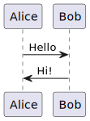
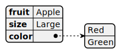

Regular **Markdown** here.

<!--
    
@startuml DiagramOne

Alice -> Bob: Hello
Bob -> Alice: Hi!

@enduml
    
-->



More regular **Markdown** here.

<!--
    
@startyaml DiagramOtherName
fruit: Apple
size: Large
color: 
  - Red
  - Green
@endyaml
    
-->

```yaml
fruit: Apple
size: Large
color: 
  - Red
  - Green
```



More regular **Markdown** here.